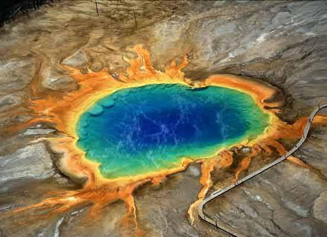

还记得那部z灾难电影《2012》吗？还记得电影里面黄石公园发生的特大火山喷发吗？美国黄石国家公园一座沉睡了64万年的超级火山，于过去7年来以破纪录速度隆起，恐怕会发生史上第4次爆发。若真的爆发，厚达30厘米的火山灰将笼罩1600平方公里的区域，届时美国将有2/3地区无法居住，航空交通瘫痪，数百万计居民无家可归，植物也可能消失殆尽。

黄石超级火山位于美国中西部怀俄明州西北角的黄石国家森林公园，占地面积近9000平方公里，是世界上最大的活火山。火山整体以黄石湖西边的西拇指 (West Thumb) 为中心，向东向西各15英里，向南向北各50英里，构成一个巨大的火山口。在这个 火山口下面蕴藏着一个直径约为70公里、厚度约为10公里的岩浆库，这个巨大的岩浆库距离地面最近处仅为8公里，并且还在不断地膨胀，从1923年至今，黄石公园部分地区的地面已经上升了70厘米。2011年1月，科学家们警告称，黄石火山或许已经进入活跃期，据模拟分析显示，一但该火山喷发将导致灾难性后果。

该座超级火山在过去210万年中，总共爆发过3次。科学家自1923年起，开始纪录火山隆起速度，单是过去3年每年就上升了7.6厘米，前所未见。由于数据不够全面，研究人员暂不敢断言第4次爆发何时发生，不过若爆发，影响将比去年4月爆发的冰岛火山还要大。		