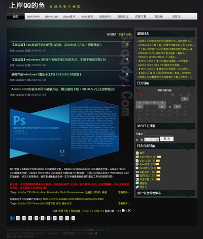

自从使用PJ博客以来，一直都是使用自己设计的皮肤，走过了很长一段历程。到现在为止一共设计了5款皮肤，其中4款都是以清爽、简单为主题，以各大浏览器的兼容性为保证，以严格的CSS标准为核心，以超酷的视觉为目的而设计的。

四款清爽皮肤下载地址：<a href="http://www.saqqdy.com/news/saqqdy-pjblog3-skins-cleanlily">http://www.saqqdy.com/news/saqqdy-pjblog3-skins-cleanlily</a>

这次，我开始设计个性化很强的，外观很前卫的皮肤，于是出了这第一款炫彩透明皮肤。
其实要设计一款皮肤真的不难，难的就是要解决浏览器直接的兼容性，这是设计的皮肤除了在外观上有了超级绚丽的视觉效果，浏览器的兼容性方面也是前所未有的，已经完美兼容了各大主流浏览器：IE6、IE7、IE8、Firefox、Safari、Chrome等等。尤其是IE浏览器，兼容性方面做得相当不错。

另外，皮肤里面还有CSS3.0标准的无图圆角，皮肤里面所有的按钮都是有圆角的（由于IE浏览器暂时不完全支持CSS3.0，所以IE浏览器没有圆角效果！），特别酷，特别炫！！

继第一款炫彩皮肤出来之后，后续将会有更多的炫彩皮肤，更酷、更炫，满足各位的个性要求！
期待PJ博客4的到来！本站皮肤也会更新PJBlog4皮肤，同步发布！

另外，尊重版权是最基本的品德，鉴于近来发现个别网友修改皮肤版权，现做出声明：希望各位网友尊重版权，做一款皮肤实在不容易，望各位网友不要修改皮肤版权，谢谢合作！！

皮肤名称：上岸QQ的鱼
适用版本：PJBlog3
作 者：吴峰

使用说明：最佳分辨率：最佳：1280x800或更大
兼容浏览器：IE6、IE7、IE8、FireFox 、Safari、Chrome等！

版权说明：随意使用，请注明出处并保持版本完整性，请勿修改皮肤版权信息，谢谢合作！！
我的博客：http://www.saqqdy.com
我的邮箱：admin@saqqdy.com

皮肤预览：

下载地址：[download id="955" format="1"]

更多皮肤即将放出，敬请期待！！		