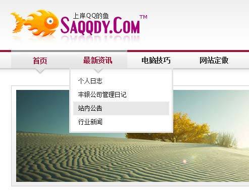

很荣幸的发布这篇文章，不知道各位网友有没有发现本站的变化？上岸QQ的鱼网站主题在昨夜进行了升级，在原有基础上新增了二级导航菜单，很绚丽，很方便！废话不多说，马上上图！

看到没？赶紧去看看吧！

上岸QQ的鱼网站主题名为WebDancer，WebDancer已经于去年年底发布下载，现最新版本为v1.2，WebDancer是一款非常简洁的主题，在源码上作了大大的简化，对于html架构、CSS样式表也作了长期的优化，使用WebDancer可以让你的博客更加受搜索引擎青睐。

WebDancer更多详情及下载地址详见：《<a title="上岸QQ的鱼独创清丽WordPress主题WebDancer正式发布下载" href="http://www.saqqdy.com/download/saqqdy-original-elegant-wordpress-theme-webdancer-download-the-official-release" target="_blank">上岸QQ的鱼独创清丽WordPress主题WebDancer正式发布下载</a>》		