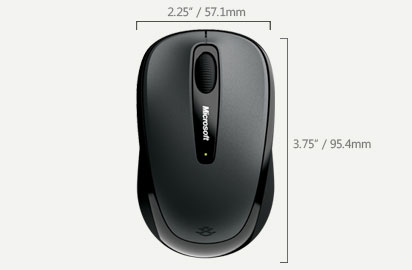

用过很多鼠标，也丢了很多鼠标，上岸QQ的鱼对于鼠标品质的要求一直都是比较高的。首先我不是个追求外观的人，我看重鼠标的实用性。先后估计用过10几个鼠标了吧，最近使用的是网上比较流行的保时捷造型鼠标。这款鼠标在我的摧残之下已经不成样子了，磨损的都不成样子了，颜色也被汗水腐蚀了。。。总之一塌糊涂。不过这个鼠标跟了我两年，虽然15元的鼠标估计大家都不看好，但确实是我用过最好用的鼠标。

然后我开始尝试无线鼠标，买的第一款无线鼠标是"吉星"的。太恶心了，那玩意儿简直能要人命，不仅信号差（隔着人体信号就没了），用起来还会飘，要点击一个目标搞半天都到不了。无奈，无线鼠标的梦就此搁浅了。

直到3天前，同学推荐我使用微软蓝影技术鼠标，抱着一试的心情就买了个试试。感觉相当不错！

下面给出点蓝影鼠标的官方介绍吧：

?** BlueTrack? 技术 **
Microsoft BlueTrack 技术将光学与高精度激光技术相结合，几乎可在所有表面上实现出色的跟踪。

?** 即插即用 Nano 收发器 **
在您准备工作时插入 Nano 收发器，或是将其装载入鼠标内。

?** 8 个月的电池使用寿命 **
一节电池能连续工作 8 个月。电池状态指示灯在电池电量不足时会显示警告。

?** 鼠标开关 **
不使用鼠标时会关闭电源，可节省电池电量。

?** 左右手操作均宜 **
左右手操控均宜，这种灵巧的外观设计能同时支持左右手使用习惯。

?** 三年硬件质保 **

特点：微软鼠标送的电池不想国内的鼠标那样，微软送的电池是质量相当好的高性能电池；
微软蓝影鼠标包装设计十分精美；

缺点：省电方面，其实大多数无线鼠标都采用自动断电来节约电源，毕竟不是每次都能记起关闭鼠标电源；

PS：刚刚拿到鼠标的时候就发现一个小问题，在使用微软蓝影鼠标滚动滚轮查看QQ聊天窗口的消息记录时，滚轮不起左右，而我之前使用的有线鼠标是正常的，于是我猜测是驱动的问题，到官方网站下载驱动之后果然就OK了。

这里要提醒各位使用微软鼠标的用户，使用微软硬件产品最好安装微软官方的驱动，以免出现使用不畅快的现象。安装微软官方驱动之后还会有很多特性功能，非常的有意思。		