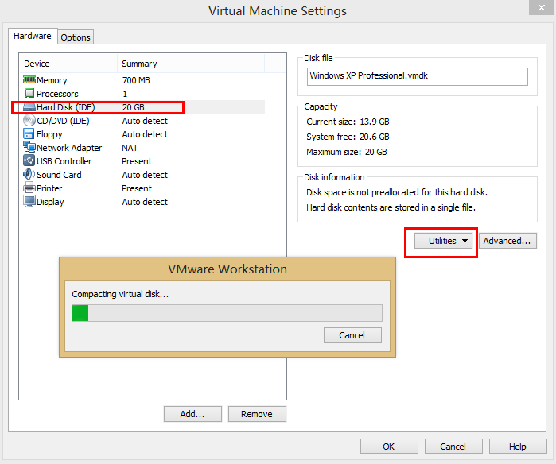

玩VMware Workstation的都知道，虚拟机在使用一段时间后，占用的实际硬盘空间比你创建虚拟机时分配的空间还要大，而且只增不减，时间久了，你的硬盘会报容量不足，仔细一看是放虚拟机的文件夹很大，以创建40G的XP为例，等使用一段时间后发现实际占用75G，太吓人了。

打开虚拟机进行碎片清理等，实际占用的容量还是不减。以前玩vmware 8的时候，系统栏有个vmware图标，双击之后可以打开VMware工具，可以对虚拟机进行压缩。但是VMware Workstation 9之后好像没有了，双击图标已经看不到了，是这样吗？

于是网上介绍的使用VMware tools里的shrink功能对于VMware Workstation 9来说，是不可以的，实际上是这个功能转位置了。

打开虚拟机设置，Hard Disk--Utiltities--下的Compacting，可以压制下
打开虚拟机设置，Hard Disk--Utiltities--下的Defragment，清理下碎片

使用shrink功能
VM--Manage--Clean Up Disks...可以收缩硬盘空间		