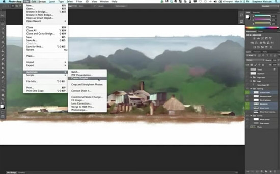

Photoshop是Adobe公司旗下最为出名的图像处理软件之一，集图像扫描、编辑修改、图像制作、广告创意，图像输入与输出于一体的图形图像处理软件，深受广大平面设计人员和电脑美术爱好者的喜爱。在这里，上岸QQ的鱼要给大家爆料Photoshop CS6 Beta版。千呼万唤始出来，终于迎来了CS6。

CS6带来了全新的用户界面，完善了内容识别填充，整合了新的Adobe云服务（<a title="你知道吗？Adobe是全球第二大云端服务商" href="http://www.saqqdy.com/news/adobe-is-the-worlds-second-largest-air-services" target="_blank">Adobe是全球第二大的云服务提供商</a>），改进了3D效果、滤层、文件搜索等等。该版本同样包括Photoshop、Illustrator、DreamWeaver、InDesign等组件。

** 支持运行环境： **Windows XP/Vista/Windows7

注意：该版本是英文版，安装过程无需序列号。

Adobe Photoshop CS6 Beta下载：<a href="http://www.saqqdy.com/?r=http://labsdownload.adobe.com/pub/labs/photoshopcs6/photoshopcs6_p1_win_032112.zip" target="_blank">官方下载</a>（1.72G）
Adobe Photoshop CS6 Beta For Mac下载：<a href="http://www.saqqdy.com/?r=http://labsdownload.adobe.com/pub/labs/photoshopcs6/photoshopcs6_p1_mac_032112.dmg" target="_blank">官方下载</a>（984MB）		