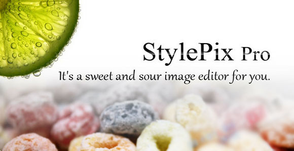
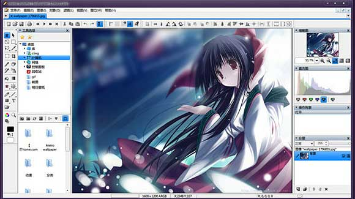

看标题，为什么说是轻量级的Photoshop呢？StylePix虽然只有2MB左右的体积，却几乎拥有Photoshop全部的功能，StylePix 是一个界面友好的图像编辑器，内存和 CPU 占用都极低，上手简单，即使是没有图像处理经验的新手，也能使用 StylePix 编辑图像，或是对数码照片进行润饰。而且，StylePix是简体中文的哦！

这款软件虽然体积小，但功能却一点也不含糊，包括了一个图像编辑器所具备的所有功能，俨然是一个迷你版的Photoshop，安装包仅 2MB 大小。StylePix 主要能够实现各种形状的图形绘制、支持图层和图层样式、图像编辑区支持格尺和和网格显示、不错的文字工具、常用滤镜、笔刷、批量处理、色彩校正和增强和渐变填充。

** StylePix 1.9.2 更新内容： **

** Improvements **
1.Check box controller's appearance improvements.

** Bug Fixes **
1.Fixed bugs that the auto scrolling features didn't work with Select And Movel tool.
2.Fixed bugs that the batch processor didn't work with format type options.
3.Fixed color palette bug.
4.Fixed bugs that the order of copied layers was changed while you duplicate the layers with Ctrl + Alt dragging.

** 支持运行环境： **Windows XP/Vista/Windows7

StylePix 1.9.2免安装版下载：<a title="StylePix 1.9.2免安装版下载" href="http://www.saqqdy.com/?r=http://kansapa.cafe24.com/hornil/products/stylepix/HornilStylePix1.9.2.zip" target="_blank">官方下载</a>（2.6MB）		