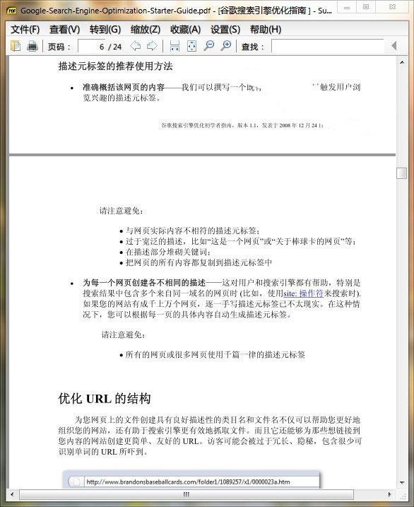

Sumatra?PDF是一款开源的绿色pdf阅读器。Sumatra?PDF的功能极度精简，速度很快。此软件免费、小巧，只有一个执行文件。Sumatra?PDF可以记住每一个PDF档案上使用者最后浏览的页面，这使得浏览电子书非常方便。

Sumatra?PDF不仅支持PDF格式，也支持?XPS、DjVu、CBZ、CBR?等格式。

Sumatra PDF 的特点

** 1、超级简洁： **主界面简约；软件设置项也极为简单；官网也是同样的简洁风格。

** 2、快速启动，快捷操作 **
① Sumatra PDF 的启动是异常迅速，几乎没有启动过程，程序界面直接呈现。
② 启动后的界面友好、方便操作。一是图形化显示最近文档。如图所示，是不是有点像Opera等浏览器的快速拨号？二是打开历史文档后，** 直接跳转到上次查看的位置 **--非常适合阅读电子书。
③ 最重要的是，Sumatra PDF 提供了大量的热键和命令行参数。

以最基本的翻页操作为例：它不仅支持最常规的PgUp/PgDn，和PDF阅读器相对标准的→/←，更支持unix风格的 n/p（TC的Lister也支持n、p）。

** 3、小巧便携 **
官网提供便携版，为单一exe文件（SumatraPDF.exe），解压之后仅 4MB，非常适合放在 U盘上随身携带。

** 4、开源协作 **
① Sumatra PDF 是开源软件（使用 GPLv3 协议）。
② Sumatra PDF 是社区合作的典范。该软件基于已有的开源 MuPDF 和 Poppler 函数库；而其官网和程序界面的多语言，也得益于志愿者的参与。因此，Sumatra PDF 不仅在应用上良好支持中文（支持中文搜索，参见主界面截屏），其官网、帮助文档、软件界面，都有中文版本。
③ 开源让Sumatra PDF更容易地移植到其他程序的扩展。

二、Sumatra PDF 进阶应用技巧

A、更多热键和命令行参数
1、看到np翻页后，你可以猜到：
j、k＝单行移动；
g＝跳转到指定页面；
q＝退出；

2、其他重要单字母热键/单键操作还有：
r＝重新载入；
+/-代表放大/缩小；
z＝在适应页面, 适应宽度, 适应内容之间切换；
c＝连续显示页面/不连续显示页面间切换；
b＝书籍视图中翻页
.＝幻灯片模式中, 背景变为黑色
w＝幻灯片模式中, 背景变为白色
i＝全屏/幻灯片模式中, 显示页码
F12：显示/隐藏书签(目录)
F6：切换书签和主窗口之间的焦点

3、特别提示一个方便浏览的热键「Ctrl+Shift+→/←」，打开同目录中的下/上一个PDF文件，非常方便多pdf浏览。

4、高级用户的最爱：命令行参数。比如 -bg-color $color 设定背景色， -page $pageno 设定打开的页码......

B、更为精简的Sumatra PDF阅读器
Sumatra PDF 阅读器的体积，实际只不到2MB。最新版本4MB的体积中，很大程度上是增加了对XPS等格式的支持。因此，** 如果你只需要PDF阅读，推荐下载更为小巧的v1.4版 **--解压后仅1.6MB。

支持运行环境：Windows XP/Vista/Windows7

Sumatra PDF 1.9.4657 下载：[download id="983" format="1"]

&nbsp;		