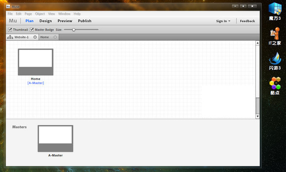

Adobe相信大家都不陌生，Adobe近来发布了Muse 0.8 Beta6，你可能是一名出色的网页设计师，但如果你不会写代码的话，设计好的网页还要请别人去制作。Adobe Muse帮你解决这个问题。

Adobe刚刚发布了一个代号为"Muse{缪斯}"网站开发工具。Muse** 基于AIR平台 **，其目的是让设计师把精力放在设计上，让那些不懂代码的设计师也可以制作、发布网站。

** Muse主要包括四大功能 **：

** 网站规划 **：Muse提供网站地图、主页面、以及覆盖整个网站的工具，你可以很快完成网站规划，为设计做好准备。

** 设计 **：让设计师专注于设计而不是工具。精确控制图片、文本、曲线等元素。用户可以使用和Photoshop或Fireworks相仿的内置工具设计网页，实际上你可以导入整个PSD文件在Muse中编辑。Muse让用户简便的整合网页内容。用户可以在设计中自由拖拽内容的位置，也可以点击'添加HTML'直接添加视频、地图或者任何网页内容。Muse还内置了数量庞大的交互小工具，可以直接使用。

** 互动性 **：支持嵌入Google地图，Facebook feed等元素，结合内置工具可提高网站互动性。支持拖拽自定义导航菜单、幻灯片、面板等内容。Muse支持最新的Web标准，包括HTML5和CSS3。另外，Muse与Adobe InDesign可以很好的相结合，创作出具有交互式内容和各种流行元素的Web站点。

** 网站发布 **：设计完网站之后，你可以在Muse内部预览上线后的效果，然后对网站进行浏览器兼容性等测试，没有问题的话就可以上线。同时，Adobe网站上也列举了好多 Muse 成品网站，专业美观。

支持运行环境：Windows XP/Vista/Windows 7

Adobe Muse 0.8 Beta 6 官方下载：<a title="Adobe Muse 0.8 Beta 6 官方下载" href="http://www.saqqdy.com/?r=http://download.macromedia.com/pub/labs/muse/muse_p06_install_win.exe" target="_blank">官方下载</a>（5.33MB）

Adobe Muse 需要AIR平台的支持：<a title="Adobe AIR平台官方下载" href="http://get.adobe.com/cn/air/" target="_blank">Adobe AIR平台官方下载</a>		