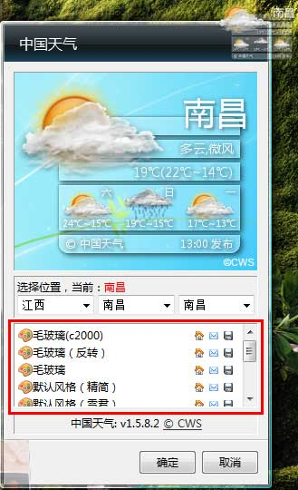

大家一定遗憾windows7的天气小工具蛋疼吧？windows7的天气工具形同虚设，完全不能在国内使用，挺遗憾的，不过最近发现一款比windows7的那款还要好的天气小工具，不仅有很多款精美的皮肤，而且在网络中断状态的时候也不会出现"服务器连接失败"的提示，相当的人性化！！

设置界面：

下载地址：<a href="http://pan.baidu.com/share/link?shareid=132487&uk=1661085386" target="_blank">点击下载此文件</a>		