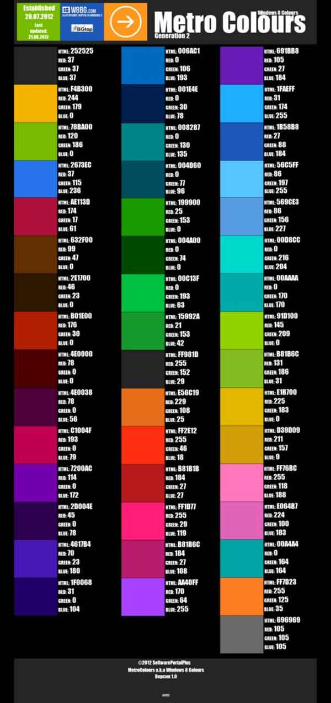

是不是很喜欢Windows8这种全新的风格呢？Windows8那种初印象特别深刻，纯色鲜明的 Modern UI诠释着什么叫做纯粹，尤其喜爱到了个性化这一步骤，选择各式各样的颜色的时候特别犹豫，貌似看起来都挺好看的。

那么， Windows8 Modern UI主要用到的到底是哪些颜色呢？由SoftwarePortalPlus制作，这个色值表很适合经常开发 Modern UI风格软件的朋友。

		